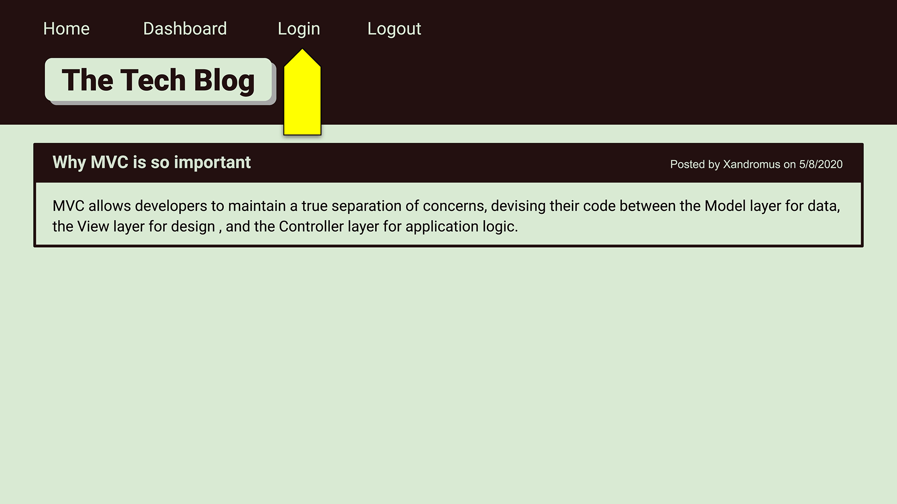

# Tech-Blog
This application is a CMS-style blog where developers can publish their blog posts and comment on other developers' posts as well.

## User Story

```md
AS A developer who writes about tech
I WANT a CMS-style blog site
SO THAT I can publish articles, blog posts, and my thoughts and opinions
```

## Acceptance Criteria

```md
GIVEN a CMS-style blog site
WHEN I visit the site for the first time
THEN I am presented with the homepage, which includes existing blog posts if any have been posted; navigation links for the homepage and the dashboard; and the option to log in
WHEN I click on the homepage option
THEN I am taken to the homepage
WHEN I click on any other links in the navigation
THEN I am prompted to either sign up or sign in
WHEN I choose to sign up
THEN I am prompted to create a username and password
WHEN I click on the sign-up button
THEN my user credentials are saved and I am logged into the site
WHEN I revisit the site at a later time and choose to sign in
THEN I am prompted to enter my username and password
WHEN I am signed in to the site
THEN I see navigation links for the homepage, the dashboard, and the option to log out
WHEN I click on the homepage option in the navigation
THEN I am taken to the homepage and presented with existing blog posts that include the post title and the date created
WHEN I click on an existing blog post
THEN I am presented with the post title, contents, post creator’s username, and date created for that post and have the option to leave a comment
WHEN I enter a comment and click on the submit button while signed in
THEN the comment is saved and the post is updated to display the comment, the comment creator’s username, and the date created
WHEN I click on the dashboard option in the navigation
THEN I am taken to the dashboard and presented with any blog posts I have already created and the option to add a new blog post
WHEN I click on the button to add a new blog post
THEN I am prompted to enter both a title and contents for my blog post
WHEN I click on the button to create a new blog post
THEN the title and contents of my post are saved and I am taken back to an updated dashboard with my new blog post
WHEN I click on one of my existing posts in the dashboard
THEN I am able to delete or update my post and taken back to an updated dashboard
WHEN I click on the logout option in the navigation
THEN I am signed out of the site
WHEN I am idle on the page for more than a set time
THEN I am automatically signed out of the site 
```

## Mock-Up

The following animation demonstrates the application functionality:



## Set-Up

This application uses the [express-handlebars](https://www.npmjs.com/package/express-handlebars) package to implement Handlebars.js for the Views, the [MySQL2](https://www.npmjs.com/package/mysql2) and [Sequelize](https://www.npmjs.com/package/sequelize) packages to connect to a MySQL database for the Models, and utilizes an Express.js API for the Controllers.

Also needed was a [dotenv package](https://www.npmjs.com/package/dotenv) to use environment variables, the [bcrypt package](https://www.npmjs.com/package/bcrypt) to hash passwords, and the [express-session](https://www.npmjs.com/package/express-session) and [connect-session-sequelize](https://www.npmjs.com/package/connect-session-sequelize) packages to add authentication.

## Development Process

The development process involved many steps. After the initial set-up and installation of all necessary packages, we started by creating the database and seeding all the data for the ssers, posts and comments after creating the models for each and their respective relationships in the models folder.

Next, we created the routes for handling the back-end of the app. These files take care of the different get, post, puts, and deletes for each post, user, and comment. Then, we created the views to actually display the necessary content.

### Challenges

The challenges faced in the project laid in the connecting between all files to have everything work harmoniously together. In terms of future development, I would like to clean up the actual look of the blog itself to give it a nicer layout and structure that is more visually appealing.

## Credits

* MySQL2 - [MySQL2](https://www.npmjs.com/package/mysql2)

* Sequelize - [Sequelize](https://www.npmjs.com/package/sequelize)

* Connect Session Sequelize - [connect-session-sequelize](https://www.npmjs.com/package/connect-session-sequelize)

* DotEnv - [dotenv](https://www.npmjs.com/package/dotenv)

* Inquirer - [InquirerJs](https://www.npmjs.com/package/inquirer/v/0.2.3) NPM package to interact with the user via the command-line.

* Express - [EspressJs](https://www.npmjs.com/package/express)

* Express Session - [express-session](https://www.npmjs.com/package/express-session)

* Express-Handlebars - [Express-Handlebars](https://www.npmjs.com/package/express-handlebars)

* Bycrypt - [bcrypt package](https://www.npmjs.com/package/bcrypt)

## Links

GitHub Repository - [Tech Blog App Repository](https://github.com/ktrudickm/Tech-Blog "Tech Blog App")

Heroku - [Heroku Tech Blog]()